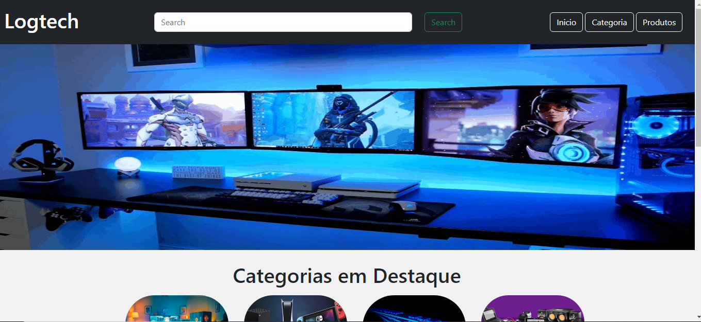
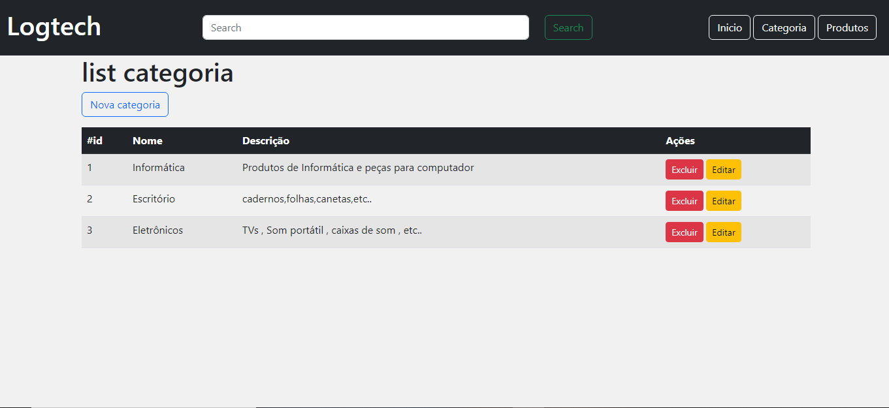
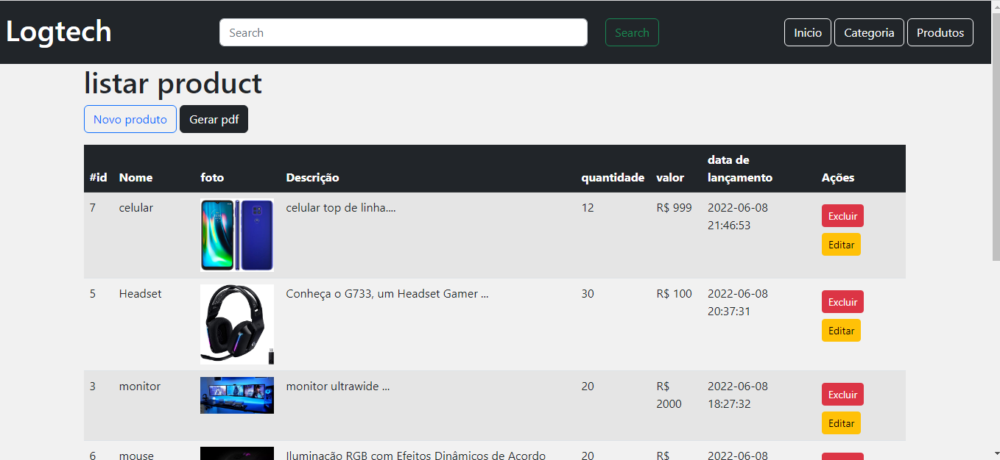

# beacademy-devstart-php-db

Projeto criado em PHP , foi feito um crud manipulando categorias/produtos utilizando arquitetura MVC e banco de dados;

## Funcionalidades

- Cadastro de produtos e categorias
- Edição de produtos e categorias
- Exclusão de produtos e categorias
- listar produtos

## Aprendizados

- Uso de Bootstrap v5.
- PHP
- POO
- banco de dados.

## Screenshots

- Tela de home
  
  
  

- Tela de listagem de categoria
  

  - Tela de listagem de categoria
    

## Autor

[@PabloHenrique🚀]()
